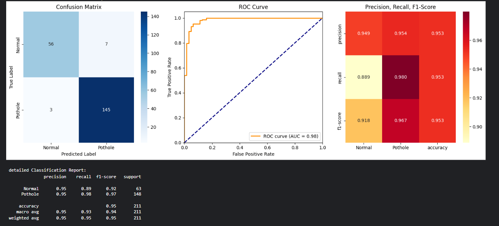
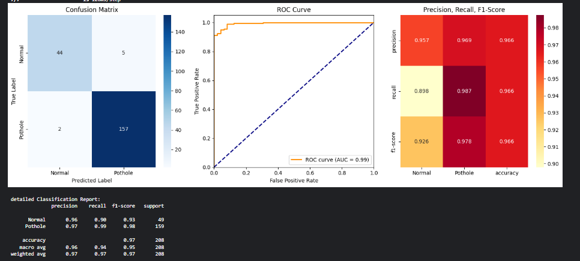
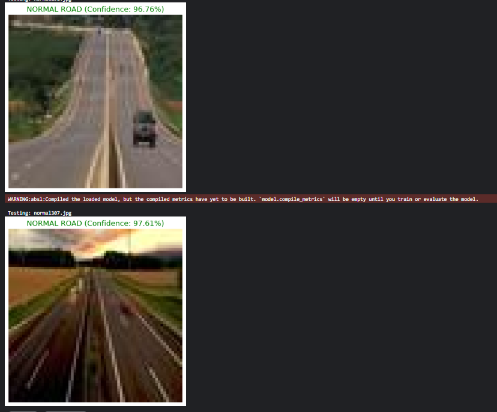

#  Pothole Detection System using Deep Learning

##  Overview
This project implements a deep learning-based computer vision system to detect potholes in road images. It aims to support smart road maintenance and improve transportation safety.

---

##  Framework Awareness
This project leverages deep learning frameworks such as TensorFlow/Keras to simplify model development.

Key features provided by the framework:
- GPU acceleration for faster training
- Automatic differentiation (backpropagation)
- Predefined layers (CNN, Dense, Activation)
- Optimizers and loss functions

Additionally, Scikit-learn is used for evaluation metrics and performance analysis.

---

## Project Pipeline
1. Data Collection (Pothole image dataset)
2. Data Preprocessing (resizing, normalization)
3. Model Building (Convolutional Neural Network)
4. Training and Validation
5. Model Evaluation

---

## Results
- Model Accuracy: 93.17%  
- Evaluation Metrics:
  - Confusion Matrix
  - ROC Curve
  - Precision, Recall, F1-score  

## Results

### Confusion Matrix

### ROC Curve

### Sample Predictions

---

## Error Analysis
- Model struggles in low-light or blurred images  
- Misclassification occurs between potholes and road cracks  
- Dataset imbalance affects prediction quality  

---

##  Performance Improvements
- Increase dataset size  
- Apply data augmentation  
- Use advanced architectures (ResNet, YOLO)  
- Hyperparameter tuning  

---

##  Technologies Used
- Python  
- TensorFlow / Keras  
- OpenCV  
- Scikit-learn  
- Matplotlib  

---

## Project Structure

pothole-detection/
│── notebook.ipynb
│── README.md
│── requirements.txt
│── results/
│ ├── confusion_matrix.png
│ ├── roc_curve.png
│ ├── sample_predictions.png

---

## Future Scope
- Real-time pothole detection using webcam  
- Integration with web/mobile applications  
- Smart city road monitoring systems  

---

## Author
Bikram Chapagain  
Computer Engineering Student